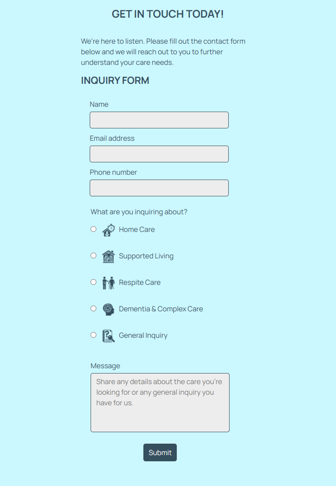
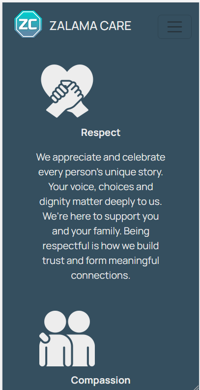
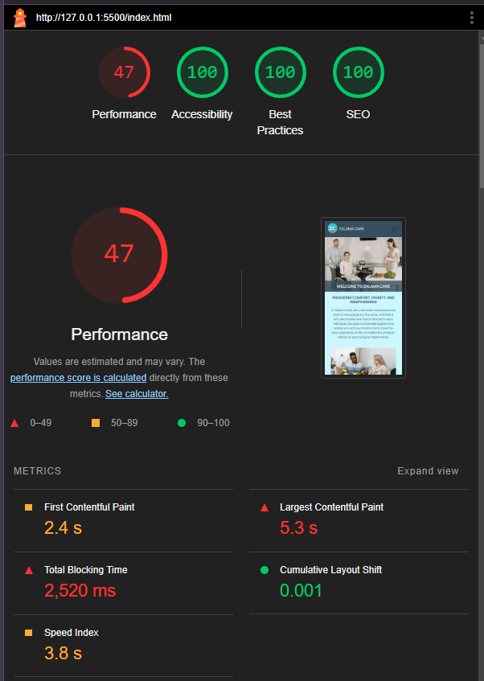
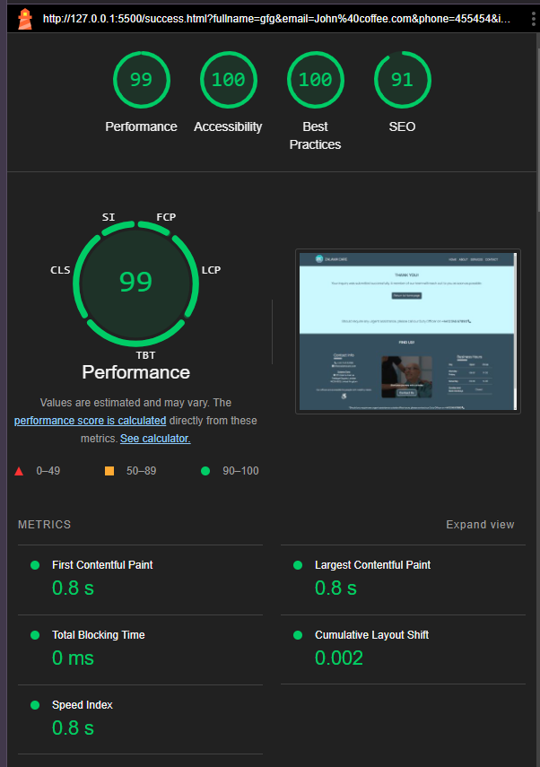

# Zalama Care Services

**Authors:** Tumelo Maja (GitHub username: tumelo-maja)

<strong>NB:<strong> The username 'tumelomaj' under contributors is the author's alternative account. All commits in this project are through username 'tumelo-maja'.

Zalama care service is all about empowering people to live a quality and dignified life with a right support for their care needs. The services is available for little help at home, full-time care support or temporarily while you recover from an illness or after a surgery.   

**The website is aimed at helping users to:** 
 - find the right care package for their unique care needs.
 - access the relevant information about what daily activities are supported in a care package.
 - get in touch and ask any questions they may have about getting care for themselves or their loved ones.
 - learn and understand Zalama Care's mission, vision and commitment to providing compassionate care 

**Target audience:** 
- Elderly individuals with limited mobility.
- Individuals living with disability (physical, cognitive and mental). 
- Families looking to get support for their loved one.
- Individuals who have just had a surgery or an illness that has limited their mobility.

The website offer clear and user-friendly information about different types of social care services, enabling users to make informed decisions about getting care. Individuals seeking care for themselves and their loved ones can select a care package that meets their needs. Users can also send an inquiry to request more information or to get started with a care package if their choice. Important business information is displayed on the website, including business and addresses, contact number and details about business hours. The design and interactivity of the site ensures users will have a positive experience while visiting the website and thereby building trust and confidence in the expected quality of service. 

## Features 

### Existing Features
- **Logo icon and Navigation Bar - pages: Home, About, Services and Contact**
  <figure>
    
     
    <figcaption><strong><em>Navbar: Home page</em></strong></figcaption>
  </figure>

  - **Logo** - when clicked, it allows users to return to home from any part of the website

  - **Navbar | Home** - returns user to home pages

  - **Navbar | About** - Allows user to navigate to the about page to learn more about the company's history, mission, vision statements and the team

  - **Navbar | Services** - Allows users to navigate to the services section within the home page to get information about the types of care services we offer at Zalama care.

  - **Navbar | Contact** - This navigates users to the contact page where they can complete a form to get in touch with the business or inquiry about a service

- **Landing page image**
  <figure>
    
     
    <figcaption><strong><em>landing page image: Home page</em></strong></figcaption>
  </figure>

  - **Image** - the landing home page features a high quality images of three people smiling. A woman in a wheel is representative of target audience with mobility needs.

  - **Welcome text** - the background image has a 'Welcome To Zalama Care' text; together with the image they create a warm welcoming and will grab the attention of the users. 

- **Introduction section** 
  <figure>
    
     
    <figcaption><strong><em>Introduction section: Home page</em></strong></figcaption>
  </figure>

  - **Introduction text** - This introductory text describes Zalama care's approach and belief in service practice. This is to give user confidence that our goal is to support and empower our service users.

  - **Introduction images** - Good quality images supporting the introductory text further enhances the users experience  

- **Our services section**
  <figure>
    
     
    <figcaption><strong><em>Our services section: Home page</em></strong></figcaption>
  </figure>

  - **service types** - This section present the different types of care service Zalama Care offers. This will allow users to learn more and decide on a suitable for themselves or their loved ones. 
  -  A 'Read more' button under each service type can be used to expand the description text for users to view additional information about the service type. Once expanded, there is a 'Show less' button to collapse the additional text.
  - The icon displayed besides the 'Read more'/ 'Show less' icons is clickable and has the same functionality to expand and collapse additional text.

    <figure>
      
      
     <figcaption><strong><em>Our services section (expanded): Home page</em></strong></figcaption>
    </figure>

- **Why choose us section**
  <figure>
    
     
    <figcaption><strong><em>Why choose us section: Home page</em></strong></figcaption>
  </figure>

  - **Our values** - The section allows the user to see and understand Zalama Care's values as a care service provider so the user can be confident about their expectations on our service.
  - Call-to-Action - There is a clear and visible prompt 'Enquire now' button to invite the user to contact us. Once clicked, the user will be directed to the contact page where there is a contact form. 

- **Getting started section**
  <figure>
    
     
    <figcaption><strong><em>Getting started section: Home page</em></strong></figcaption>
  </figure>

  **Onboarding steps** 
    - This section provides an easy guide to the onboarding steps for users interested in get care support from Zalama care. The users are able to have information on what to expect once they complete a contact form or reach out to us by any means. This information shows transparency and will enhance user's confidence in our care services. 
    - Call-to-Action - There is a clear and visible prompt 'Let's talk today!' button to invite the user to contact us. Once clicked, the user will be directed to the contact page where there is a contact form. 

- **Find us section**

  The footer is consistent section featured in all pages similar to the navbar. These are the sub-sections within the footer:

  - **Contact information** - This sub-section provides the user with essential contact information about the business. The phone, email and address icons will enlarge when hovered over to enhance user experience.
    <figure>
      
       
      <figcaption><strong><em>Contact Info in footer: All pages</em></strong></figcaption>
    </figure>

    - Phone number - Full contact number with the relevant dial extension. For convenience, the phone icon besides the phone number is clickable and will take mobile users dial pad screen with the contact number inputted and ready to call. For laptop and desktop users, it will prompt client to make a call if they have a relevant application for making calls.

    - Email address - An info@zalamacare.com email address is shown for users who prefer to send an email. Similar to the phone icon, the 'envelope' icon besides the email address is also clickable and with prompt user to send and email with default emailing application on their device. 

    - Office address - The location of our offices is presented so users can see how close or far the offices are to their places of residence. This is also useful for users who prefer to visit our offices. The location icon is clickable and will launch a navigation app (e.g. Google Maps App) on mobile devices. For larger devices it will open a new tab in the browser with a location on Google maps.

    - Disability accessibility - A note is shown to users so they know that our business offices accommodate individuals with mobility needs. This will enhance comfort and confidence in users with mobility needs who may want to visit our offices. 

  - **Video clip with CTA** 
    <figure>
      
       
      <figcaption><strong><em>Video in footer: All pages</em></strong></figcaption>
    </figure>

    - A good quality video with dimmed brightness and a 'Contact us' button offer a visually appealing user experience while prompting them to contact us. The video auto-plays in a loop but is always muted and there are no controls to interact with the video

  - **Business hours** 
    <figure>
      
       
      <figcaption><strong><em>Business hours in footer: All pages</em></strong></figcaption>
    </figure>
    
    - The business hours section allows the user to be informed on the opening and closing times during weekdays, weekends and bank holidays. This information is useful for users to know when they can contact our offices. 

    - After hours notice - This information informs the users that they can still get in touch with our office even outside office hours through a dedicated Duty Officer line. This assures users that we are always reach at all times should they require assistance. The phone icon will enlarge when hovered over to enhance user experience and is clickable to initiate a call.  

  - **Images and video credits** 
    <figure>
      
      
       
      <figcaption><strong><em>Images and video credits in footer: All pages</em></strong></figcaption>
    </figure>
    
    - Credits link - the 'Images and video credits' link allows user to see the source and attribution of images, video and icons used in this website. The link opens a modal with a list specifying images, image addresses and the authors were required. All links in the modal open in a new tab.

    - Educational purpose note - This is only presented for educational purpose to inform any user that may access this to understand that is not a real service company.

  - **Follow us section** 
    <figure>
      
       
      <figcaption><strong><em>Follow us in footer: All pages</em></strong></figcaption>
    </figure>

    - This section provides links to social media accounts for the business. NB: since this is a fictional business it has not accounts on those platforms. The links will open in a new tab and direct the user to the home page of each social platform. The icons enlarge when hovered to enhance user experience. 

- **About us: Our history** 
  <figure>
    
     
    <figcaption><strong><em>Our history: About page</em></strong></figcaption>
  </figure>

  - This section provides users with information about the company's history which will add to its credibility and build trust with users. 

  - Family lunch image - A quality image with positive emotions will further enhance user experience visually. 

- **About us: Our Mission and Vision sections** 
  <figure>
    
     
    <figcaption><strong><em>Our Mission and Vision: About page</em></strong></figcaption>
  </figure>

  - Mission and vision statements enhance user's confidence in the expected service and assures them that our goals are aligned their care needs.

  - Images - Good quality images showing happy people will enhance and excite a positive emotion in the user.  

- **About us: Our Team section** 
  <figure>
    
     
    <figcaption><strong><em>Our Team: About page</em></strong></figcaption>
  </figure>

  - Our team - this section presents the office staff, each shown by their portrait, name, role and contact info. This will enhance confidence in user's expectations and improve user's experience reading their personal statements. 

  - contact info - Each team member has phone number and email address. This will make it more convenient for users to direct their emails to the relevant staff member or to call. Phone and email icons will enlarge when hovered over, and a clickable to initiate and email or call 

  - field staff count - Showing number of available field staff builds trust and confidence in our capability to provide services. 

- **Contact: Contact form** 
  <figure>
    
     
    <figcaption><strong><em>Contact: Contact form</em></strong></figcaption>
  </figure>

  - Form - this allows users to contact the business about any questions they may have about care services and or to initiate getting a package for Zalama Care. This is a valuable feature as it facilitates communication between the users and the business with ease. 

  - Form validation - all fields in the form are required. Users will not be able to submit the form with empty field or invalid inputs. 
  
  - Name and message field accept text as input, phone number can only numerical integers, email address must follow email address format including having the '@' symbol. The user is required to select the type of inquiry they have from the given options. 

- **Success: valid submission** 
  <figure>
    
     
    <figcaption><strong><em>Success: valid form submission</em></strong></figcaption>
  </figure>

  - Successful submission confirmation will appear when the user submits a valid form. This confirmation is good user experience as it alerts the user the their form was submitted successfully. It also provides a message on the next step i.e. a team member will reach to them as soon as possible. This create a positive anticipation from the user wanting to communicate with us.

  - Return to homepage - There are no further actions once the form is successfully submitted, the user is shown a way back to the home page.

  - Urgent queries notice - This is useful for users who have submitted a form but require urgent assistance. The presented contact number is reachable for urgent queries even after office hours. 

13) Responsive design
- Website layout and outlook remains consistent on different screen sizes which improves user experience 

### Features Left to Implement
This subsection covers other feature that would add good value to the site but are reserved for future releases of the project site.
1) Testimonials image carousel
- This would display past and existing client's stories/testimonial about their experiences with Zalama care's level of service. This is to build trust and confidence in the brand/service for the business.
2) Sign-up form for newsletter 
- A form to allow users to subscribe for business news, updates and any events from the business 
3) Careers's page
- For recruitment purposes, this page will provide information about working at zalama care, how to apply and what vacancies are available. The page will feature an application form for interested job-seekers.

## Project planning
in this section, we provide all tasks related to project planning. 

User stories and business goals are defined in this section

### Key business goals

Primary goal: Increase sales of care service packages.

Other goals:
- Share information about social care options we offer
- Increase engagement from visitors through enquiries and social media
- Improve online presence with high quality and accessible website
- attract potential employees through careers's page

### User stories

- **Accessible and User-Friendly Navigation (must-have)**

  - Story: 
  As a visitor (general), I want a user-friendly website with a clear and intuitive navigation so I can find specific information about care services.

  - Acceptance Criteria:
  The website layout and navigation are intuitive making it easier for visitors to find important information on the site
  The website is fully responsive and accessible on various devices with different screen sizes
  All website content can be accessed by assistive technologies like screen-readers 

  - Tasks:
  Implement HTML/CSS code to ensure responsiveness on different screen sizes
  Use the appropriate aria attributes to ensure compatibility with assistive technologies (e.g. screen readers)
  Implement a user-friendly and intuitive layout with clear navigation for the website for ease of access to important information

- **Information on types of services offered (must-have)**

  - Story: 
  As a potential service user (or family/friend of), I need detailed descriptions of types of services offered so I can decide on a suitable service for me (or loved one).

  - Acceptance Criteria:
  There is a dedicated page with detailed information and description of different types of services offered
  There is a section in the home page with brief/summary information about different types of services offered and with links to the services page

  - Task:
  implement HTML to provide descriptions of services in the services page and in a section of the home page 
  Structure and style the content to include quality images
  Include a clear CTA button/link in under each service type in the services page 
  ensure responsiveness across different screen sizes

- **Contact and address information (must-have)**

  - Story:
  As a family member seeking care support for my loved one, I need to find contact details so I can call or visit the office and enquire about some of the services.

  - Acceptance Criteria:
  Essential contact information is present in a clear and well-structured manner (phone, email, address and operating times) 

  - Task:
  Implement HTML section for the contact information (phone, email and address) and business hours
  Structure and style the content to ensure responsiveness on screen sizes

- **Enquiry form (must-have)**

- Story:
  As potential service user, I want to enquire about my specific needs for care and ask to be contacted.

  - Acceptance Criteria:
  A page dedicated for enquiries with a user-friendly form to submit, the form confirms on submission
  Add floating CTA buttons so visitors can click to be re-directed to the contact us page 
  All form fields are validated where required and form is responsive 

  - Task:
  Implement an enquiry form in the contact us page 
  Ensure all essential fields in the form are validated before submission
  create a confirmation page to acknowledge submission

- **Company mission, vision, values and team (should-have)**

  - Story:
  As a family member/potential service user, I want to learn and understand the company's values and team expertise so I can feel confident about my expectations of care for my loved one 

  - Acceptance Criteria:
  An about page clearly presents the company's vision and mission statements in an easy to read manner
  organisation staff are displayed with their name, email and one-liner about why they're in social care 
  core values are briefly described in the 'why choose us' section of the home page with a link to 'about' page
  CTA to guide visitors to explore more about our service (links to services section) or contact us (links to contact us)

  - Task:
  Implement about-us page with the company's mission & vision statements presented in a friendly and informative format
  Add 'Our team' section in the about page, include an image, name, role, email and one line of positive comment about work
  present core values in the 'why chose us' section using icons and brief description of those values
  Include a small text with links/buttons to invite the visitors to explore 'services' sections or CTA for contact us

- **Onboarding steps (should-have)**

  - User story:
  As a prospective service user/family member, I want to see a brief outline of the different stages to go through in order to receive care services, so i can make an informed decision about requesting the service for myself/family member.

  - Acceptance criteria:
  A section that gives an outline of the 4 stages of new service user onboarding from initial enquiry
  Each step/stage is clearly presented in an easy to read format
  CTA is included to guide the client towards the inquiry form

  - Task:
  Add HTML and content for onboarding section
  Style and format the section with the use of appropriate icons/images
  Include a clear CTA for visitors to send an inquiry via the contact-us page 

- **Testimonials  with positive stories (could-have)**

  - Story:
  As a potential service user, I want to read testimonies from from current/past service users so I can be assured and confident about the quality of service offered.

  - Acceptance Criteria:
  A dedicated testimonial section features stories from current clients, shows name of client, type of service, year and one liner of feedback
  Visually appealing high-quality images have been used and visitors can navigate through multiple testimonies with ease.

  - Task:
  Create an auto sliding carousel of bootstrap cards with essential text (name, service type, year service received, comment) and quality images
  Style the section to ensure it is responsive 

- **Newsletter Sign-Up form (could-have)**

  - Story:
  As a family member of service user, I want to sign-up for newsletter so I can stay informed about tips and guides we can employ to support our loved one 

  - Acceptance Criteria:
  Newsletter sign-up form is available at the bottom of all pages
  Visitors get confirmation about their subscription after submitting the form

  - Tasks:
  Create a sign-up form for the newsletter, include fields (full name and email)
  Implement confirmation message once submission has been completed.

- **Careers page for recruitment (could-have)**

  - Story:
  As a job seeker, I want to find information about career/employment opportunities so I can submit an application online to be considered for future opportunities 

  - Acceptance Criteria:
  A careers page has been created with a responsive application form
  The page has content relevant for job seekers explaining benefits, job requirements and overview about working for the company
  Confirmation is sent when the user (job seeker) submits an application form

  - Task:
  create a careers page with an overview of benefits, general job requirements
  Add an application form with fields (name, contact, email, address, experience, submit CV)
  There should be confirmation to acknowledge submission of application form

### Wireframes
<figure>
  
   
  <figcaption><strong><em>Wireframe: Home page</em></strong></figcaption>
</figure>
<figure>
  
   
  <figcaption><strong><em>Wireframe: About page</em></strong></figcaption>
</figure>
<figure>
  
   
  <figcaption><strong><em>Wireframe: Contact Us page</em></strong></figcaption>
</figure>
<figure>
  
   
  <figcaption><strong><em>Wireframe: Careers page</em></strong></figcaption>
</figure>

### Color Pallet
We used the color pallet generator from
(https://coolors.co/)

## Testing 

### Feature Testing
For each interactive feature, a testing was conducted and the results are outlined in a table below

| Feature                 | Testing                         | Outcome                             |
| --------                | -------                         |-------                              |
| Logo Icon               | Click on the logo               | User is brought to the home page    |
| Navbar \| Home          | Click on "HOME" in Navbar       | User is brought to the home page    |
| Navbar \| About         | Click on "ABOUT" in Navbar      | User is directed to the about page  |
| Navbar \| Services      | Click on "SERVICES" in Navbar   | User is directed to the home page  and scrolled down to the services section |
| Navbar \| Contact       | Click on "CONTACT" in Navbar    | User is directed to the contact page  |
| Navbar responsiveness     | Adjust screen view in Dev Tools for mobile/laptop/desktop   | Navbar is collapsed for screens size below (<992px width) and expanded for larger screens (>=992px)  |
| 'Read more' button  (when collapsed)    | Click on "Read more" button in the services section of for all the service types   | Service type section expand and additional information is shown. 'Show less' button appears in place of 'Read more' |
| 'Show less' button (when expanded)     | Click on "Show less" button in the services section of for all the service types   | Service type section collapse and additional information is hidden. 'Read more' button re-appears in place of 'Show less' |
| Service type icon (besides 'Read more' / 'Show less')     | Click on the service icon in the services section of for all the service types   | Service type section collapse and additional information is hidden. 'Read more' button re-appears in place of 'Show less' |
| 'Contact us' button in the home page - intro section | Click on 'Contact Us' button in the intro section (home) |  User is directed to the contact page |
| 'Enquire now' button in the home page - 'why choose us' section | Click on 'Enquire now' button in the 'why choose us' section (home) |  User is directed to the contact page |
| 'Let's talk today!' button in the home page - 'Getting started' section | Click on 'Let's talk today!' button in the 'Getting started' section (home) |  User is directed to the contact page |
| 'Contact us' button in the footer - all pages | Click on 'Contact Us' button in the footer - all pages tested |  User is directed to the contact page |
| Phone icon in the footer - all pages (mobile) | Click on the phone icon button in the footer - all pages tested |  mobile device's phone dialer app is launched with the contact number pre-filled  |
| Phone icon in the footer - all pages (desktop) | Click on the phone icon button in the footer - all pages tested | User gets a pop-up prompt to launch dialer application  |
| Email icon in the footer - all pages (mobile) | Click on the email icon button in the footer - all pages tested |  mobile device's default email app is launched with the receiver's email address pre-filled |
| Email icon in the footer - all pages (desktop) | Click on the email icon button in the footer - all pages tested |  desktop/laptop's default email app is launched with the receiver's email address pre-filled |
| Location icon in the footer - all pages (mobile) | Click on the location icon button in the footer - all pages tested |  mobile device's default navigation app is launched with the location address pre-filled |
| Location icon in the footer - all pages (desktop) | Click on the location icon button in the footer - all pages tested |  a new Google maps tab is launched with the location address pre-filled |
| Disability accessibility  icon in the footer - all pages (desktop/mobile) | Click on the disability icon in the footer - all pages tested |  a pop-up modal is launched and display additional information relating to accessibility |
| Images and video credits link in the footer - all pages (desktop/mobile) | Click on the "Images and video credits" link in the footer - all pages tested |  a pop-up modal is launched and display additional information about images, video and icons sources/credits |
| Social media icons in the footer - all icons in all pages (mobile) | Click on each of the social media icons (facebook, twitter, Linkedin & Instagram) in the footer - all pages tested |  mobile device's corresponding app is launched or a new tab in the browser is lunched and the user is directed to the home page for each social media link |
| Social media icons in the footer - all icons in all pages (desktop) | Click on each of the social media icons (facebook, twitter, Linkedin & Instagram) in the footer - all pages tested |  a a new tab is launched and the user is directed to the home page for each social media link |

### Browser Compatibility
The website's layout and responsiveness was tested on the commonly used browsers. The test is based on the quality of browser rendering of the website as intended and its responsiveness to screen width variations. 

| Browser         | Intended Appearance | Intended Responsiveness |  
|---------------  |---------------------|-------------------------|  
| Google Chrome   |          Good       |           Good          |  
| Mozilla Firefox |          Fair       |           Good          |  
| Microsoft Edge  |          Good       |           Good          |  

### Responsive Testing 

### Code validation

| Page Tested | Screenshot of Errors | Solution Applied   | Screenshot of Clear Validator Output |  
|------------ |------------          |------------        |------------                          |
| index.html  | |**warnings:** section element without header was changed to a div   **info:** redundant forward slashes in self closing elements were removed | |    
| about.html  | |**info:** redundant forward slashes in self closing elements were removed | |  
| contact-us.html  | |**error:** label tag without corresponding input field; the radio buttons were wrapped in a fieldset   **info:** redundant forward slashes in self closing elements were removed | |     
| success.html  | |**info:** redundant forward slashes in self closing elements were removed | | 
| styles.css  | |**error:** border attribute with too many values; this was an unused styling and was removed   **warnings:** Underline styling on the navbar elements had 'background-color' and 'color' set to the same values; 'color' was removed as there is not content   - About 118 warnings from variables added by Autoprefixer to accommodate other browsers; nothing can be done about these warnings - they do not affect functionality and layout of the website i.e. they would be ignored by browsers that cannot interpret them | |   

### Bugs

**Form validation message: Contact form** 
  <figure>
    
    
     
    <figcaption><strong><em>navigating to 'Services' not scrolling to display section header: Nav Bar - Services</em></strong></figcaption>
  </figure>
- (All browsers) Due to an unknown effect/cause, the validation message for when a users attempts to submit an invalid form (empty fields/ incorrect input format) does not appear on certain occasions . Since this occurs occasionally with no clear pattern, there is no solution for it at present. 

- **Status:** Not resolved.

**Navigation to Services: Nav Bar** 
  <figure>
    
     
    <figcaption><strong><em>navigating to 'Services' not scrolling to display section header: Nav Bar - Services</em></strong></figcaption>
  </figure>

- (All browsers for collapsed Nav Bar) When navigating to 'Services' section from about, success or contact-us page; the page does not scroll low enough to display the section header 'OUR SERVICES'; this is covered by the fixed Nav Bar. However, when navigating from within the index ('HOME') page, the page scrolls low enough for the header to be displayed. For large screens (=>992px) this issues does not occur. 

- **Status:** Not resolved.

**Navigation not collapsing: Nav Bar** 
  <figure>
    
     
    <figcaption><strong><em>navigating to 'Services' not scrolling to display section header: Nav Bar - Services</em></strong></figcaption>
  </figure>

- (All browsers for collapsed Nav Bar) When a has the Nav Bar expanded and they click anywhere on the screen except the nav bar items; the nav bar does not collapse. To collapse the the navbar, the user has to click on the toggle button use to expand. This lead to a poor user experience.  

- **Status:** Not resolved - Could require JS script.

**Icon alignment: Why choose us? section**

  <figure>
    
    
     
    <figcaption><strong><em>Values icons not centered (left image) - Fixed (right image)</em></strong></figcaption>
  </figure>

- (Mozilla Firefox only) the 'values' icons under 'why choose us?' are aligned to the left while they're intended to be centered about the text. This issue has not been observed in Chrome or Edge browsers.

- **Status:** Resolved - This was achieved by styling the icon parent div to 'display: flex;' then applying 'justify-content:center' to center the icon horizontally  

**Submit button alignment: contact form** 
  <figure>
    
     
    <figcaption><strong><em>Submit button not centered: Contact form - contact page</em></strong></figcaption>
  </figure>

- (Mozilla Firefox only) the 'Submit' button the contact form  is aligned to the left while it's intended to be centered about the form fields. This issue has not been observed in Chrome or Edge browsers.  

- **Status:** Not resolved.

**H1 alignment: Home - hero section**
  <figure>
    
    
     
    <figcaption><strong><em>'WELCOME TO ZALAMA' not aligned to the right (left image) - Fixed (right image)</em></strong></figcaption>
  </figure>

- (Mozilla Firefox only) the 'WELCOME TO ZALAMA' h1 element, overlaying the background hero image, is aligned to the left while it's intended to be aligned to the right.

- **Status:** Resolved - This was achieved by applying 'display: flex' to the hero parent div of h1, then 'justify-content: end' and 'align-items: end' to bring the h1 element to bottom right of the parent

### Lighthouse Testing
Lighthouse testing was performed for all pages (desktop and mobile views)

| Screen Type | Initial audit | Solution Applied  | Screenshots of Clear Validation Output | 
| ----------- | ------------- | ----------------- | -------------------------------------- |
|   Mobile - index.html  |  | Input images in the page were properly re-sized using an online tool to bring the dimensions closer to the rendered sizes for different screens. This improved the image loading time and thereby improving the web page performance  |  |
|   Desktop - index.html |  | Input images in the page were properly re-sized using an online tool to bring the dimensions closer to the rendered sizes for different screens. This improved the image loading time and thereby improving the web page performance  |  |
|   Mobile - about.html  |  | Input images and icons in the page were properly re-sized using an online tool to bring the dimensions closer to the rendered sizes for different screens. This improved the image loading time and thereby improving the web page performance  |  |
|   Desktop - about.html |  | Input images and icons in the page were properly re-sized using an online tool to bring the dimensions closer to the rendered sizes for different screens. This improved the image loading time and thereby improving the web page performance  |  |
|   Mobile - contact-us.html  |  | Input images and icons in the page were properly re-sized using an online tool to bring the dimensions closer to the rendered sizes for different screens. This improved the image loading time and thereby improving the web page performance  |  |
|   Desktop - contact-us.html |  | Input images and icons in the page were properly re-sized using an online tool to bring the dimensions closer to the rendered sizes for different screens. This improved the image loading time and thereby improving the web page performance  |  |
|   Mobile - success.html  |  | logo images ('icon') was properly resized using an online tool to bring the dimensions closer to the rendered. This improved the icon loading time and thereby improving the web page performance  |  |
|   Desktop - success-us.html |  | logo images ('icon') was properly resized using an online tool to bring the dimensions closer to the rendered. This improved the icon loading time and thereby improving the web page performance  |  |

### Accessibility Testing

To ensure our site is accessible to assistive technology like screen readers and for people with visual impairment, accessibility tests were conducted.

**Lighthouse - Accessibility**

| Page Tested | Initial output | Solution Applied   | Final validator Output |  
| ----------- | -----------    | -----------        | -----------            |
| index.html  |   | - 'aria-label' attributes were added to all links in the page    - 'aria-hidden' attribute was added to the decorative video element in the footer used as background.  |   |
| about.html  |   | - 'aria-label' attributes were added to all links in the page    - 'aria-hidden' attribute was added to the decorative video element in the footer used as background.  |   |
| contact-us.html  |   | - 'aria-label' attributes were added to all links in the page    - 'aria-hidden' attribute was added to the decorative video element in the footer used as background.  |   |
| success.html  |   | - 'aria-label' attributes were added to all links in the page    - 'aria-hidden' attribute was added to the decorative video element in the footer used as background.  |   |

**WebAIM - Contrast Checker**
Color contrast between foreground and background in elements was check using <a href="https://coolors.co/contrast-checker" target="_blank">WebAIM tool</a>. Another contrast chekcer, <a href="https://coolors.co/contrast-checker" target="_blank">Coolors Contrast Checker</a> had similar results. 

| Element Tested | Initial validator output | Final validator Output |  
| -------------- | --------------           | --------------         |
| Nav Bar        |   |  |
| Body text      |   |  |
| Footer      |   |  |

## Deployment

This section provides the steps to follow when deploying the project.

- The site was deployed to GitHub pages. The steps to deploy are as follows: 
  - In the GitHub repository, navigate to the Settings tab 
  - Scroll to and select 'GitHub pages'
  - Under the 'Source' drop-down menu, select the 'main'(master) as the branch.
  - Once the master branch has been selected, the page will be automatically refreshed. There should be a ribbon displayed at the top of the page indicating successful deployment.
  - The website is now live and can be accessed from repository home page by clicking 'github-pages' under 'Deployments' on the right-side.
  - The link to the website should be displayed at the top showing the latest deployed version.   

Alternatively the site's live link can be found here - (https://tumelo-maja.github.io/zalama-care/index.html)

## Credits 

### Text content

- **Lantern Care Services**: A significant portion of the text content on the website is based on discussions held with Moira Mccumskey, the founder and director for Lantern Care Services in Crewe, England United Kingdom. Information about what type of services care companies provide to their clients. 

- **Cheshire East Council**: [Care and support for adults](https://www.cheshireeast.gov.uk/livewell/care-and-support-for-adults/care-and-support-for-adults.aspx)
  Information how care is provided including descriptions of certain types of care available for adults and elderly people. 
 
-**NHS Supported living**: [Supported living Services](https://www.nhs.uk/conditions/social-care-and-support-guide/care-services-equipment-and-care-homes/supported-living-services/)
  Information on supported-living service type was used in the services section  

- **NHS Dementia care**: [Help and support for people with dementia](https://www.nhs.uk/conditions/dementia/care-and-support/help-and-support/)
  Information on dementia care was used in the services section  

- **NHS Reablement**: [Care after illness or hospital discharge(reablement)](https://www.nhs.uk/conditions/social-care-and-support-guide/care-after-a-hospital-stay/care-after-illness-or-hospital-discharge-reablement/)
  For respite can include individuals needing care temporarily like after surgery and an illness that limits their mobility. This information was used to supplement information in the services section.

### Images and videos

- **Font Awesome**: Icons  
  All of the icons used in the footer and main elements were sourced from [Font Awesome](https://fontawesome.com/). These icons were used to enhance user interactivity and accessibility which in turn improve user experience.

- **Freepik**: Free video and images
  The video in the footer and other images used on the website were sourced from [Freepik](https://www.freepik.com/). Some images have been used as icons in the home and contact pages. Media resources from Freepik have been explicitly acknowledged in the 'Images and video credits' modal located in the footer.

- **Pexels**: Free stock images
  There are high-quality stock images used on the website which were sourced from [Pexels](https://www.pexels.com/).

- **Pixabay**: Free stock images
  There are high-quality stock images used on the website which were sourced from [Pixabay](https://www.pixabay.com/).

- **Unsplash**: Free stock images
  There are high-quality stock images used on the website which were sourced from [Unsplash](https://www.unsplash.com/).

### Tutorials and other resources

- **Bootstrap Framework**:  
  The website’s layout and responsive design were built using the [Bootstrap framework](https://getbootstrap.com/). The layout was used as a based and custom styling was applied to create a quality, responsive website that delivers great user experience across different user devices.

- **Google Font**: Manrope 
  The *Manrope* font used throughout the website was sourced from [Google Fonts](https://fonts.google.com/). This font gives a neat and modern appearance which conveys quality. In addition, the font is readable and will provide a positive and friendly user experience while maintaining elegance.

- **CSS 'Read more'/'Show less'**: [How to Create a 'Read More' Button with Only CSS](https://www.youtube.com/watch?v=b6_u8IVVLdo)
This youtube tutorial was used to implement a custom "Read More"/"Show less" buttons in the services section of the home page. This allows users to access additional information with a simple interaction, without overloading the page with additional info.

- **Services Content**: [Home Care and ADLs](https://www.ncbi.nlm.nih.gov/books/NBK470404/)  
  The website provided description and additional information regarding activities of daily living (ADLs). It was used to help describe activities covered by a care package in the services section.

- **Background Video Tutorial**: [Add Video and Overlay with Texts/Other Elements](https://www.youtube.com/watch?v=ytnOT-gg5Lw)  
  This youtube tutorial was used to implement a background video with text overlays in the footer. This enhanced and highlighted  the call-to-action button prompting users to click the 'contact us' button.

- **Click-to-Call Button Tutorial**: [Create Click to Call Button](https://www.youtube.com/watch?v=hk5v-dO57n4)  
  This youtube tutorial was used to implement a "Click to Call" href for calls and email. This initiate a dial action so users can easily call. For emails, it launches the email app with destination address pre-filled. Users won't have to copy and paste the email or phone number in order to make contact.

- **CSS ::before and ::after Tutorial**: [Learn CSS ::before and ::after in 4 Minutes](https://www.youtube.com/watch?v=dIUOWdwwZBw)  
  This youtube tutorial was used to implement underline styling for navigation items and footer headers using pseudo-elements in CSS, enhancing user experience.

- **JavaScript for Collapsing Bootstrap Navbar**: [Code Institute](https://codeinstitute.net/)  
  The JavaScript functionality was used to ensure the Bootstrap mobile navbar collapses properly when navigating to internal links i.e. services section. The video is from the Code Institute lessons. 

- **Image Coloring - filter**: [Codepen for Coloring PNG Icons Using Hex Color Code](https://codepen.io/sosuke/pen/Pjoqqp)  
  This tool was utilized to create custom-colored PNG icons used in the services and contact page, ensuring the icons matched the site's branding and color scheme. This was used as the icons used were images and required a different method to color them appropriately.

- **Image Compression Tool**: [TinyJPG](https://tinyjpg.com/)  
  TinyJPG was used to compress and optimize the images on the site, ensuring fast loading times without sacrificing visual quality.

- **Image Resizing Tool**: [Derivv](https://derivv.com/)  
  This tool was utilized to resize images to the optimal dimensions for web display, to improve the loading time and performance of the website. Fast loading of a website enhances the user experience by removing loading delays which may lead to poor user interaction.

- **Video Accessibility Recommendation**: [Video Accessibility with Decorative Elements](https://www.drupal.org/project/bootstrap_styles/issues/3285504)  
  This resource recommendation was used to resolve footer video accessibility. Since the video was used as a decorative element, the 'aria-hidden' attribute was applied to the video element so screen readers can ignore it. 
